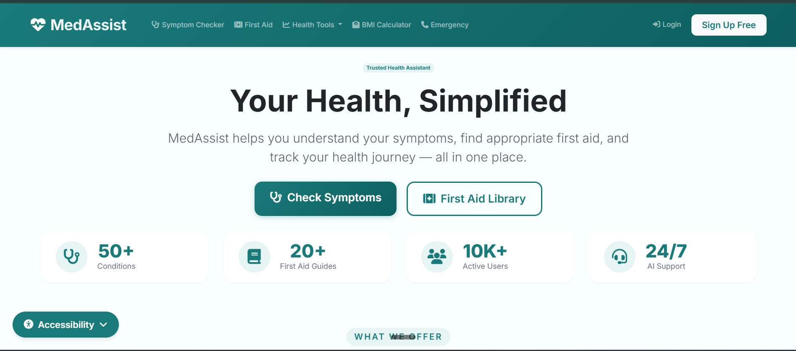
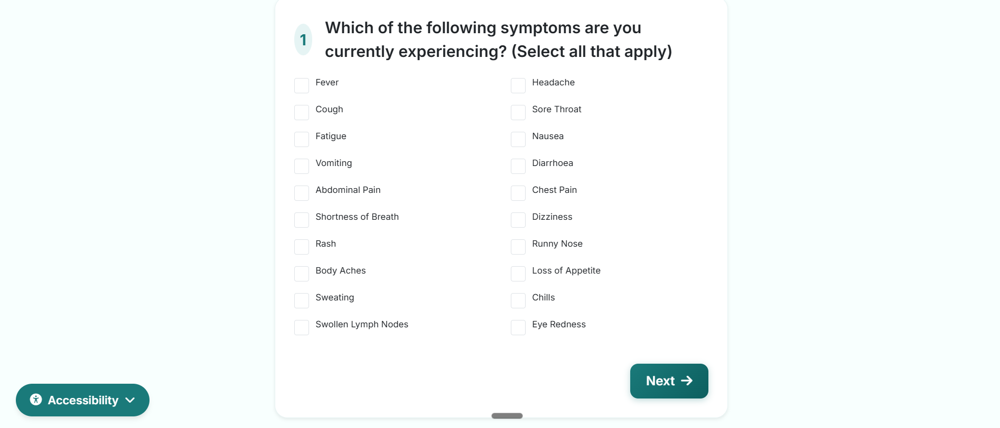
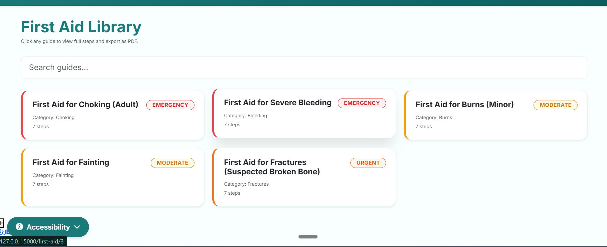
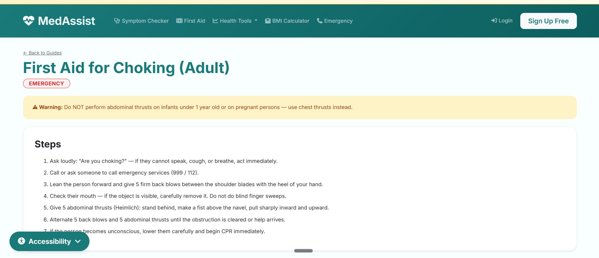
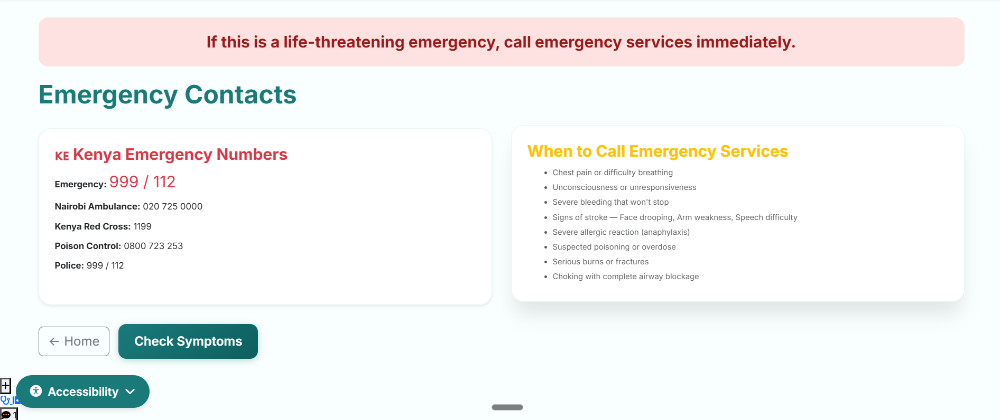

# MedAssist – Symptom Checker & First Aid Guide

## Project Explanation
MedAssist is a Flask-based web application that helps users identify possible health conditions by answering a multi-step questionnaire about their symptoms. The app suggests matching conditions with severity indicators (Low → Medium → Emergency) and provides downloadable first aid guides for common injuries like burns, cuts, choking, and sprains. A prominent medical disclaimer emphasizes that this is an educational tool only, not a substitute for professional medical advice.

## UI Technology
- **Flask** – Python web framework handling routes, requests, and server-side logic
- **Jinja2 Templates** – HTML templating with template inheritance (`base.html` extended by all pages)
- **Bootstrap 5** – Responsive CSS framework for styling, modals, and navigation
- **JavaScript (vanilla)** – Form validation, dynamic severity color coding, and PDF trigger buttons

## Database
- **SQLite** with **SQLAlchemy ORM** – Lightweight, serverless database perfect for prototyping
- **Tables:**
  - `Question` – Stores multi-step symptom questions and options
  - `Condition` – Medical conditions with severity levels and recommendations
  - `Symptom` – Individual symptoms linked to conditions
  - `SymptomCondition` – Junction table linking symptoms to conditions with weight scores
  - `FirstAidGuide` – First aid content with title, steps, category, and emergency warnings

## Python Concepts Implemented

| Concept | How It's Used in MedAssist |
|---------|----------------------------|
| **Flask Routes & HTTP Methods** | `@app.route()` decorators with GET (display forms) and POST (process symptom answers, send messages) |
| **Jinja2 Templating** | Template inheritance (``), conditionals (``), loops (``), and filters (`{{ timestamp|datetime }}`) |
| **SQLAlchemy ORM** | Defining database models as Python classes, establishing relationships (`db.relationship`), querying (`Condition.query.filter_by(severity='high').all()`) |
| **Session Management** | Storing symptom answers across the multi-step form using Flask's `session` dictionary (`session['answers'] = {'headache': True}`) |
| **Request/Response Handling** | Accessing form data via `request.form.get()` or JSON via `request.get_json()`, returning `render_template()` or `redirect()` or `jsonify()` |
| **Conditional Logic & Decision Tree** | Matching user symptoms to conditions using if/elif chains or weighted scoring algorithm (`if 'fever' in symptoms and 'cough' in symptoms: return 'Common Cold'`) |
| **Error Handling** | Try/except blocks for PDF generation failures, API call timeouts (if integrated), database connection errors, and file I/O operations |
| **File Handling & PDF Export** | Generating PDFs using WeasyPrint/ReportLab with `render_template()` for HTML-to-PDF conversion, saving to `/exports` folder, sending as downloadable response with `send_file()` |
| **Environment Variables** | Storing Flask `SECRET_KEY` and any API keys (Infermedica, Google Places, Twilio) in a `.env` file loaded via `python-dotenv` |
| **Functions & Modularity** | Creating reusable functions like `match_symptoms(symptoms_list)`, `generate_pdf(guide_id)`, `cache_api_response()`, and `send_sms_alert()` for clean, testable code |
| **Decorators** | Custom `@login_required` decorator (if user authentication added) and Flask's built-in `@app.before_request` for global actions like enforcing disclaimer acceptance |
| **List & Dictionary Comprehensions** | Efficiently filtering conditions: `[c for c in conditions if c.severity == 'high']` or building symptom option dicts from database queries |
| **JSON Parsing** | If integrating external APIs (Infermedica, OpenFDA), using `response.json()` to parse API responses and extract condition names, drug info, or hospital locations |

## Screenshots

<!-- Add your screenshots here. Replace the placeholder paths with actual image paths -->

### Homepage / Landing Page


### Multi-Step Symptom Questionnaire



### First Aid Guides Library


### First Aid Guide Detail with PDF Export


### Emergency Page



## Flask Routes & UI Pages

| Route | Method | Template | Description |
|-------|--------|----------|-------------|
| `/` | GET | `index.html` | Landing page with app overview and start button |
| `/symptom/start` | GET | `symptom_form.html` | Begins multi-step symptom questionnaire |
| `/symptom/step/<int:step_id>` | GET/POST | `symptom_form.html` | Each question step with back/next navigation |
| `/symptom/results` | POST | `results.html` | Displays matched conditions with severity colors |
| `/firstaid` | GET | `firstaid_list.html` | Browse all first aid guides with search |
| `/firstaid/<slug>` | GET | `firstaid_detail.html` | Full guide content with PDF export button |
| `/firstaid/<slug>/pdf` | GET | - | Downloads PDF version of the guide |
| `/emergency` | GET | `emergency.html` | Emergency numbers and when to call 911 |
| `/disclaimer` | GET | `disclaimer.html` | Full medical disclaimer page |

## Development Roadmap (Checklist)

### Day 1 – Setup & Database
- [ ] Create Anaconda environment (`conda create -n medassist python=3.9`)
- [ ] Install Flask, SQLAlchemy, Jinja2, WeasyPrint
- [ ] Create project folder structure
- [ ] Design SQLite database schema (models.py)
- [ ] Create `seed.py` to populate initial symptoms, conditions, first aid guides
- [ ] Test database connection in Jupyter notebook

### Day 2 – Backend Logic
- [ ] Build symptom matching decision tree (`symptom_matcher.py`)
- [ ] Implement weighted scoring algorithm for condition matching
- [ ] Create Flask routes for symptom questionnaire (GET/POST)
- [ ] Set up session management for multi-step form
- [ ] Test matching logic with sample inputs
- [ ] Write unit tests for `test_matcher.py`

### Day 3 – Templates & UI
- [ ] Create `base.html` with Bootstrap 5, navbar, footer, disclaimer
- [ ] Build `symptom_form.html` with multi-step Jinja2 form
- [ ] Create `results.html` to display matched conditions + severity colors
- [ ] Build `firstaid_list.html` and `firstaid_detail.html`
- [ ] Add client-side validation with JavaScript
- [ ] Implement severity color coding (green/yellow/red)

### Day 4 – Final Features & Testing
- [ ] Implement PDF export functionality (WeasyPrint)
- [ ] Create `emergency.html` with emergency contacts
- [ ] Add search/filter for first aid guides
- [ ] Run Jupyter notebooks for testing & analysis
- [ ] Write integration tests for all routes
- [ ] Final debugging and documentation cleanup
- [ ] Prepare demo video / screenshots

### Bonus Features
- [ ] Add user authentication (login/signup)
- [ ] Save symptom history per user
- [ ] Integrate free API (OpenFDA drug lookup)
- [ ] Add "email first aid guide" feature

## Setup Instructions (Conda Environment)

### Prerequisites
- **Anaconda Distribution** (Download from [anaconda.com](https://www.anaconda.com/download))
- Modern web browser (Chrome, Firefox, Edge)

### Step 1: Clone or Download the Project

```bash
git clone https://github.com/winstone-1/medassist.git
cd medassist

**2. Create and activate a virtual Anaconda environment**

```bash
py -3.13 -m venv venv

conda create -n medassist python=3.9
```

**3. Install dependencies**

```bash
conda install flask flask-sqlalchemy flask-session
conda install jupyter notebook
conda install weasyprint
conda install pandas matplotlib
pip install python-dotenv
```

---
## Author

Winstone Mwangi

## License

MIT License. See LICENSE for details.
